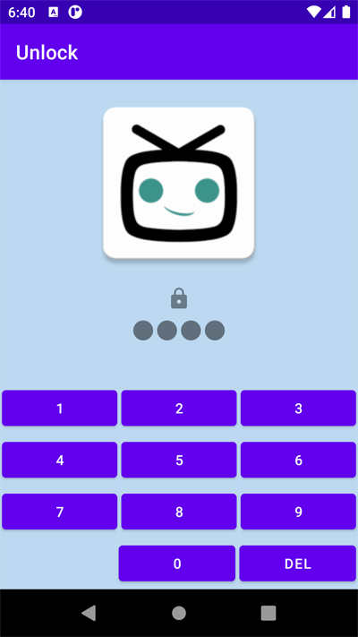

# TVMazeApp

## What is done so far

* Mandatory Features

* Allow the user to set a PIN number to secure the application

* Allow the user to save a series as a favorite

* Allow the user to delete a series from the favorites list

* Allow the user to browse their favorite series in alphabetical order, and click on one to
  see its details

* Some Unit testing for Moshi json converter and DTOs

There is an Apk exported inside the project app/release/app-release.apk

